# NextManga - Frontend

Application mobile React Native (Expo) pour la decouverte de mangas, avec recommandations, onboarding personalise et gestion de bibliotheque utilisateur.

## Stack technique

- Expo + React Native + TypeScript
- Expo Router (routing base sur les fichiers)
- i18n (FR/EN)
- Theming (clair/sombre/auto)
- API REST backend (`/api/users`, `/api/manga`, `/api/recommendations`)

## Objectif produit (V1)

Objectif: publier une V1 stable sur:

- Apple App Store (iOS)
- Google Play Store (Android)

Cette V1 se concentre sur l'experience coeur: onboarding, recommandations, bibliotheque, suivi de lecture et notifications.

## Installation et lancement

```bash
npm install
npm start
```

## Fonctionnalites frontend implementees

### 1. Authentification

- Connexion et inscription utilisateur
- Gestion du contexte d'auth (`AuthContext`)
- Recuperation et cache du profil utilisateur

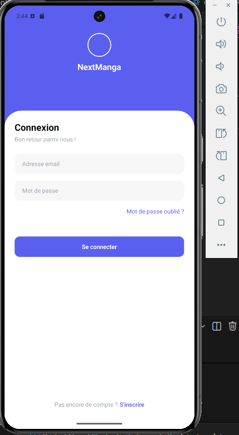
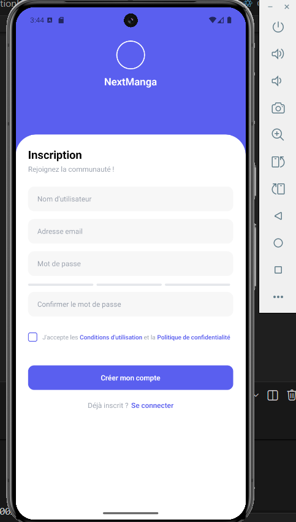

### 2. Onboarding personnalise

- Selection des genres favoris
- Selection de mangas deja lus
- Enregistrement dans l'historique au statut `completed`

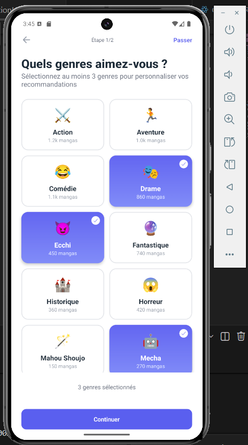
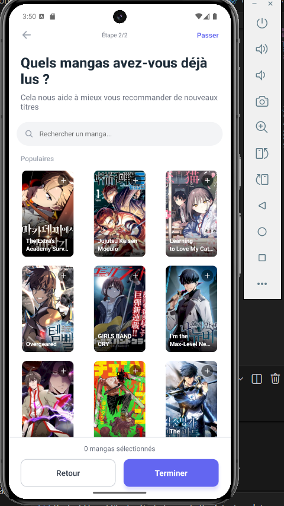

### 3. Home dynamique

- Hero banner
- Recommandations IA
- Tendances
- Nouveautes
- Continue reading
- Section Bibliotheque directement sur la home:
   - A lire (`planned`, `reading`, `paused`)
   - Deja lus (`completed`)
   - Abandonnes (`dropped`)

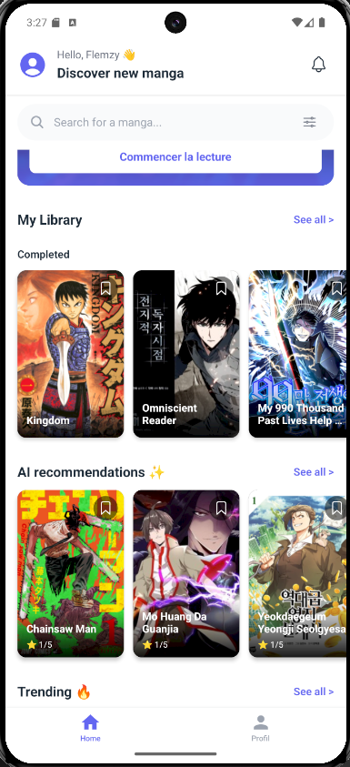
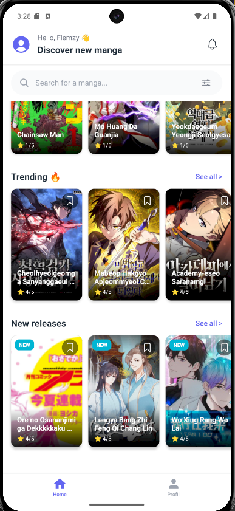

### 4. Bibliotheque utilisateur

- Ecran dedie `library`
- Onglets `A lire` / `Deja lus`
- Affichage par cartes horizontales
- Rechargement pull-to-refresh


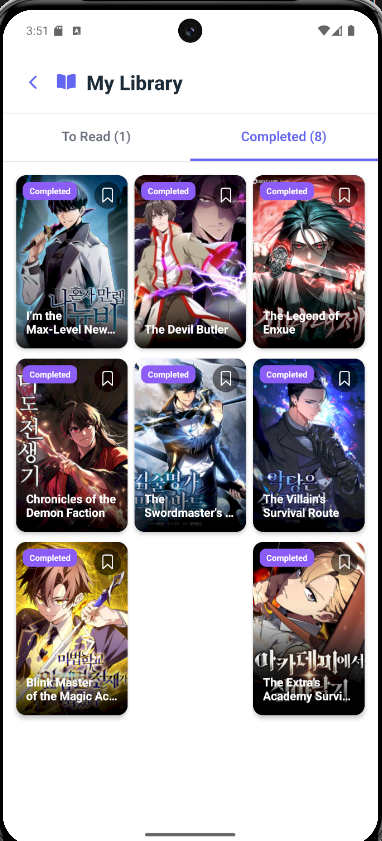
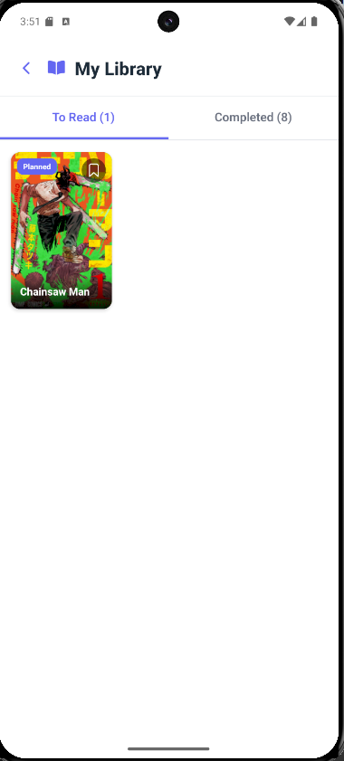

### 5. Detail manga

- Hero visuel + infos generales
- Bouton Like/Favori
- Bouton Bookmark / Ajout a la bibliotheque
- Synchronisation avec l'historique utilisateur

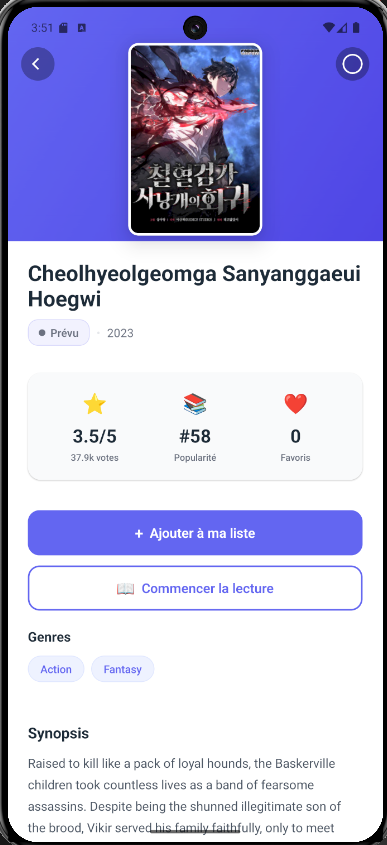

### 6. Gestion de l'historique (integration backend)

- Support complet du format backend:
   - `history`
   - `alreadyRead.items`
   - `toRead.items`
- Support du champ `coverImage` pour les visuels
- Fallback de compatibilite avec `cover`
- Endpoints integres:
   - `GET /api/users/:userId/history`
   - `POST /api/users/:userId/history`
   - `PUT /api/users/:userId/history/:mangaId`
- Support des options de requete:
   - `limit`
   - `status`
   - `enriched`

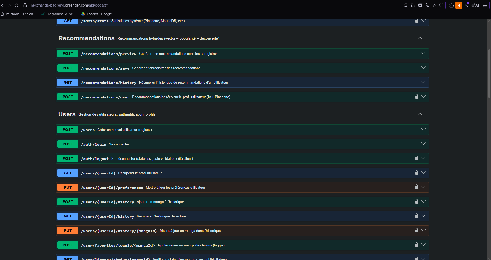

### 7. Notifications, langue et theme

- Centre de notifications dans la home
- Changement de langue FR/EN
- Changement de theme light/dark/auto
- Base de gestion des notifications deja integree (context + affichage)

Evolutions prevues pour les notifications intelligentes:

- Notifications personnalisees par manga suivi
- Regles de declenchement configurables par l'utilisateur
- Exemple: "Me notifier toutes les 5 sorties de chapitres" sur un manga
- Exemple: "Me notifier au prochain chapitre" ou "resume hebdomadaire"
- Parametres notification: frequence, heure, activation/desactivation par manga

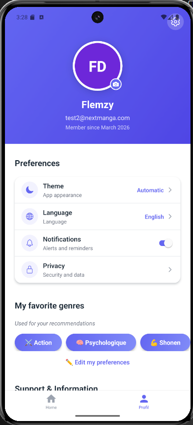
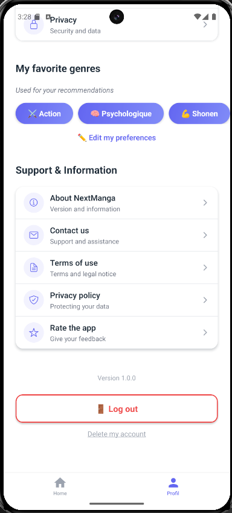

## Comment les APIs communiquent entre elles

### 1. Flux manga classique

Exemple: `GET /api/manga/:id`

1. Le routeur valide l'ID.
2. `manga.controller` appelle `anilist.service.getMangaDetails(id)`.
3. AniList repond en GraphQL.
4. Le service normalise la structure (`formatMangaResponse`).
5. Le controller renvoie une reponse JSON propre au frontend.

### 2. Flux analyse IA d'un manga

Exemple: `GET /api/manga/:id/analyze`

1. Recuperation des details depuis AniList.
2. Passage du manga formate a `groq.service.analyzeManga`.
3. Groq retourne une analyse structuree JSON (`themes`, `mood`, `keywords`, `summaryOneLine`, etc.).
4. Le backend renvoie l'objet enrichi.

### 3. Flux embedding + indexation vectorielle

Exemple: `POST /api/manga/:id/embed`

1. AniList fournit les metadonnees du manga.
2. Groq enrichit puis construit un texte representatif (genres, themes, vibes, description nettoyee).
3. OpenAI transforme ce texte en vecteur numerique.
4. Pinecone stocke ce vecteur (`upsert`) avec metadata (titre, themes, summary, score...).
5. L'API retourne le statut d'indexation.

Note: en cas de quota OpenAI depasse, un vecteur de fallback deterministe est genere pour ne pas bloquer le pipeline.

### 4. Flux recherche de mangas similaires

Exemple: `GET /api/manga/:id/similar?topK=5`

1. Meme pipeline de vectorisation que `embed` (AniList -> Groq -> Embedding).
2. Le vecteur est envoye a Pinecone en `query`.
3. Pinecone renvoie les `matches` les plus proches (similarite vectorielle).
4. L'API renvoie la liste des voisins semantiques.

### 5. Flux recommandations hybrides

Exemple: `POST /api/recommendations/preview`

1. Le backend recupere des candidats (mangas trending via AniList).
2. Si un `seedMangaId` est fourni, il calcule un score vectoriel via Pinecone.
3. Il calcule ensuite:
   - score de popularite,
   - score de decouverte,
   - bonus de preferences utilisateur (genres/themes).
4. Il combine le tout avec des poids:
   - `vector: 0.60`
   - `popularity: 0.25`
   - `discovery: 0.15`
5. Il trie, limite et renvoie les items avec `matchScore`, `matchType`, `reason`.

### 6. Flux recommandations basees profil utilisateur

Exemple: `POST /api/recommendations/user` (JWT requis)

1. Le profil utilisateur est charge depuis MongoDB.
2. Le backend cree une description texte du profil (genres/themes/rating moyen).
3. Cette description est transformee en embedding OpenAI.
4. Pinecone retourne des mangas proches de ce profil vectoriel.
5. Le backend recupere les details AniList pour chaque match et filtre les favoris existants.
6. Une liste personnalisee est retournee.

### 7. Flux utilisateur (historique, favoris, bibliotheque)

Le backend persiste dans MongoDB et enrichit visuellement les donnees:

- `history`: ajout/mise a jour d'entrees de lecture.
- `favoriteMangas`: gestion CRUD + toggle.
- `favorite-genres`: gestion CRUD + toggle.
- lors des lectures, si une cover manque, le backend tente une resolution AniList (batch IDs puis fallback recherche titre).

### 8. Flux admin de reindexation

Exemple: `POST /api/admin/reindex` (`x-admin-key` requis)

1. Charge les mangas trending.
2. Pour chaque manga: analyse Groq -> embedding OpenAI -> upsert Pinecone.
3. Applique un delai entre items (`delayMs`) pour limiter le rate limiting.
4. Retourne un bilan (`indexed`, `failed`, details par manga).


## Fichiers frontend principaux

- `app/(tabs)/index.tsx` - Home + section Bibliotheque
- `app/library/index.tsx` - Bibliotheque complete
- `app/manga/[id].tsx` - Detail manga
- `app/(onboarding)/mangas.tsx` - Onboarding mangas
- `components/home/MangaCardHorizontal.tsx` - Carte manga + rendu image
- `services/api.ts` - Client API + normalisation des reponses history

## Ameliorations possibles

- Monetisation (priorite business V1+):
   - Offre Freemium (fonctionnalites de base gratuites, options premium)
   - Abonnement mensuel/annuel (recommandations avancees, stats de lecture, experience sans pub)
   - Publicites non intrusives pour les comptes gratuits (bannieres discretes / rewarded)
   - Offres partenaires/affiliation (liens d'achat volumes papier ou goodies)
- Notifications avancees:
   - Alertes de nouveaux chapitres par manga suivi
   - Regles personnalisables (ex: notification toutes les 5 sorties)
   - Centre de preferences notification (frequence, plages horaires, opt-in)
- Qualite produit avant publication stores:
   - Etat visuel `bookmarked` persistant par carte
   - Toast utilisateur lors d'un ajout a `A lire`
   - Tests E2E des parcours critiques (auth, onboarding, history, library)
   - Validation release iOS/Android (builds, icones, splash, politique de confidentialite)
